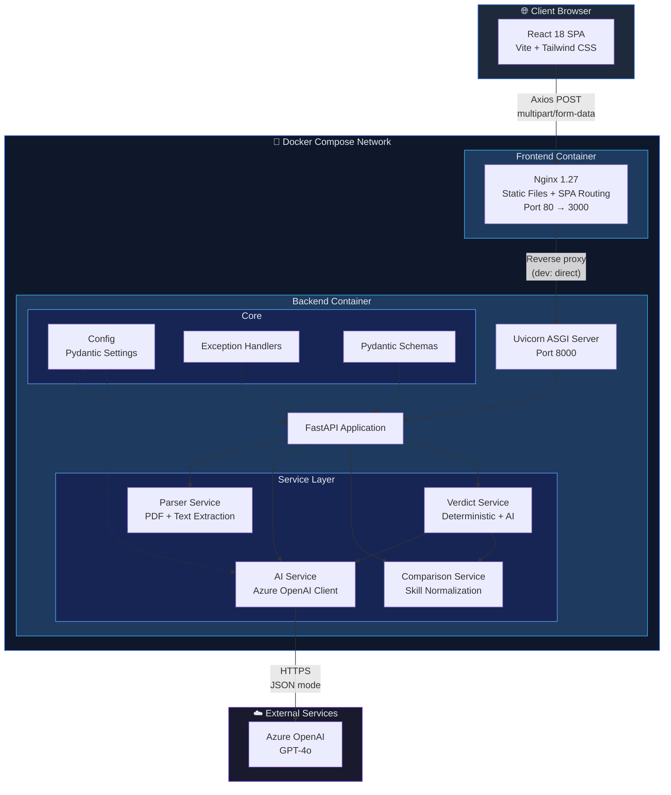
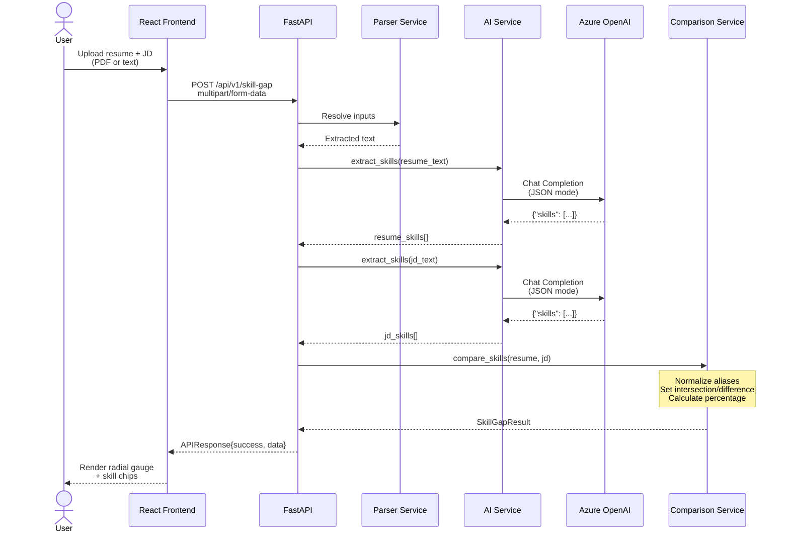
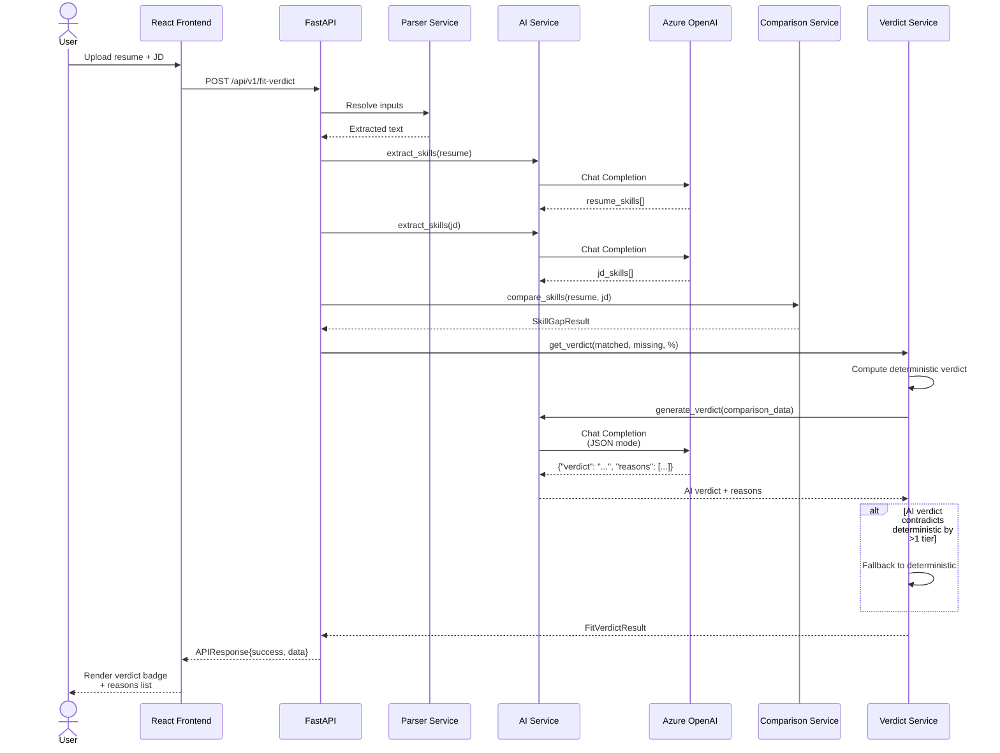
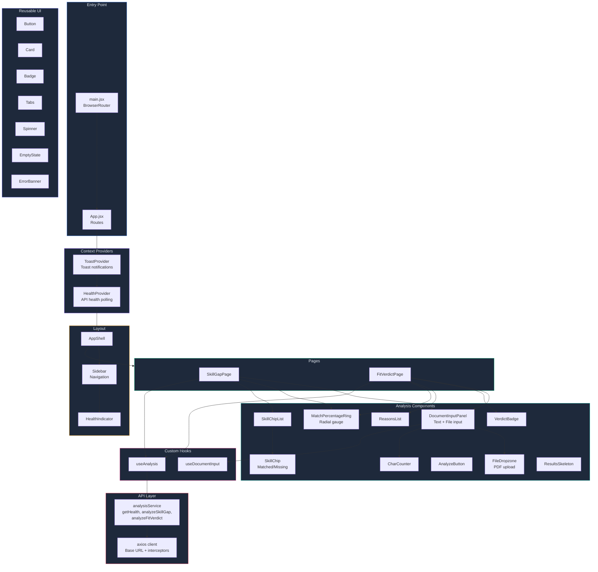
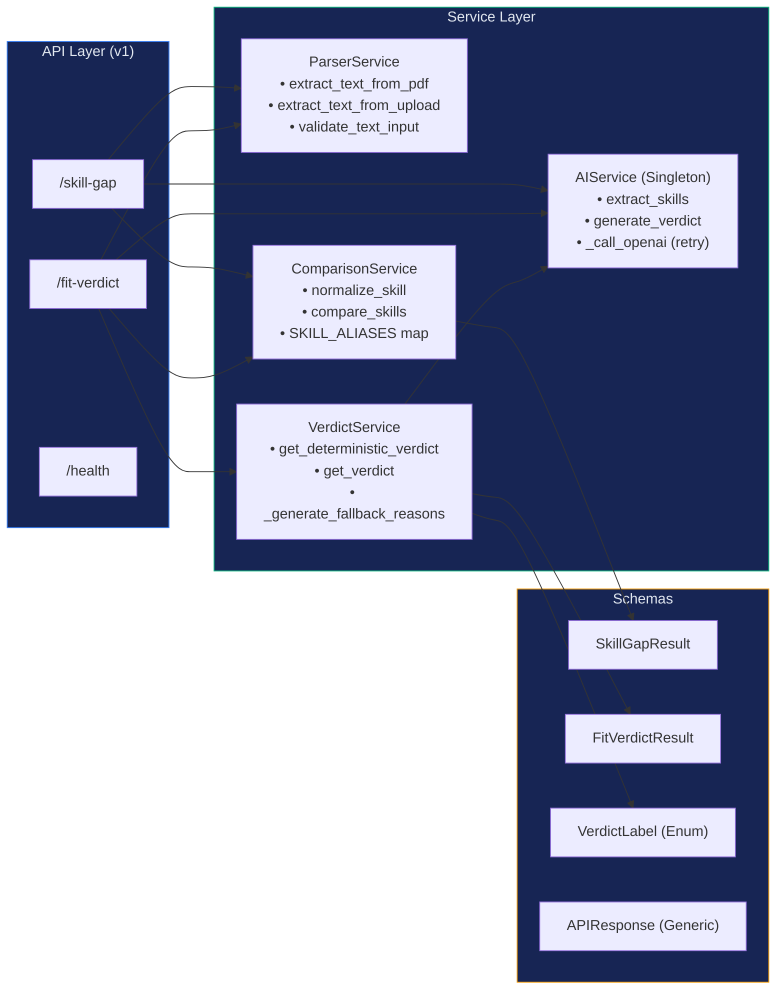
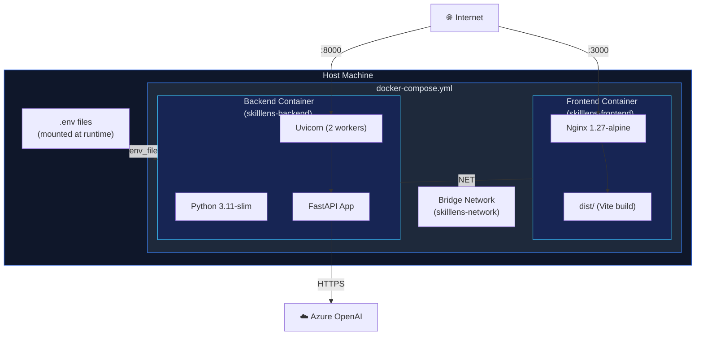

# SkillLens — Architecture

## System Architecture Diagram

---

## Request Flow

### Skill Gap Analysis (`POST /api/v1/skill-gap`)

### Fit Verdict (`POST /api/v1/fit-verdict`)

---

## Component Architecture (Frontend)

---

## Backend Service Layer

---

## Docker Architecture

### Image Sizes (Approximate)

| Image | Base | Estimated Size |
|---|---|---|
| Backend | `python:3.11-slim` | ~180 MB |
| Frontend | `nginx:1.27-alpine` | ~25 MB |

---

## Key Design Patterns

| Pattern | Where | Why |
|---|---|---|
| **App Factory** | `main.py:create_app()` | Configurable FastAPI instance creation |
| **Singleton** | `ai_service.get_ai_service()` | Single OpenAI client reused across requests |
| **Generic Envelope** | `APIResponse[T]` | Consistent response shape for all endpoints |
| **Deterministic Fallback** | `verdict_service.py` | AI failures don't break the user experience |
| **Alias Normalization** | `comparison_service.py` | Handles common skill abbreviations |
| **Context Providers** | React `ToastProvider`, `HealthProvider` | Global state without prop drilling |
| **Custom Hooks** | `useAnalysis`, `useDocumentInput` | Reusable stateful logic |
